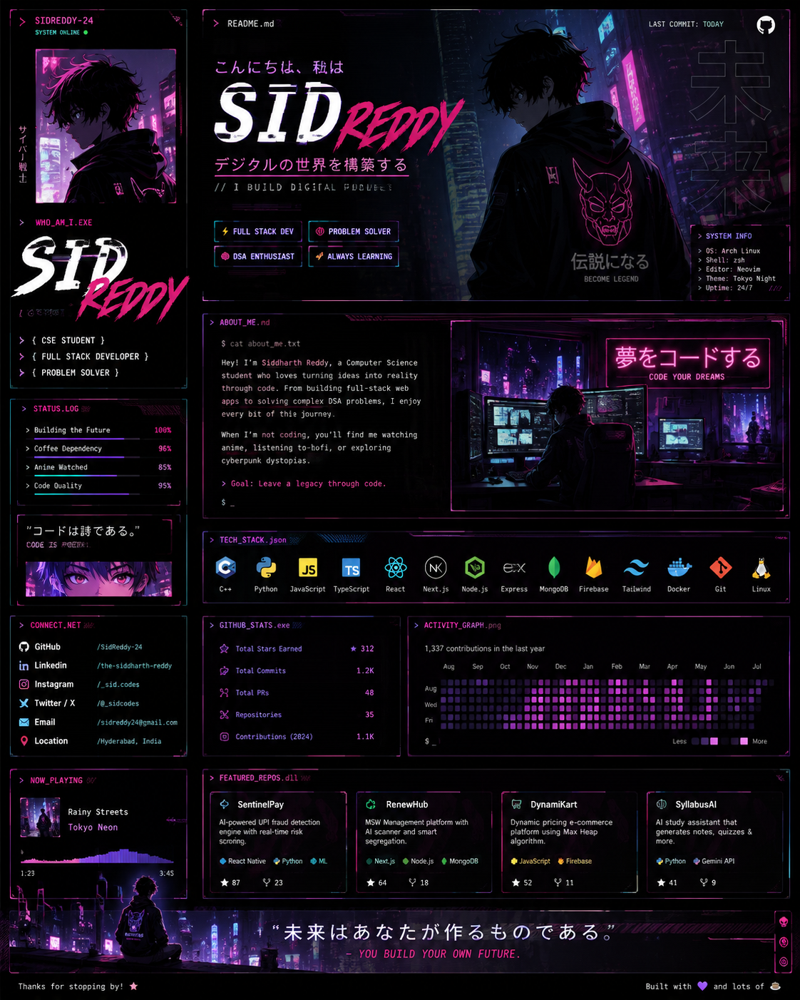

<div align="center">



# ⚡ S I D  R E D D Y

### `// FULL STACK DEVELOPER • PROBLEM SOLVER • BUILDER`


[](https://github.com/SidReddy-24)
[](https://www.linkedin.com/in/the-siddharth-reddy/)

</div>

---

## `> WHO_AM_I.exe`

```yaml
NAME: Siddharth Reddy
ALIAS: SID
ROLE: Full Stack Developer
STATUS: Building...
LOCATION: India

CURRENT_MODE:
  - Coding
  - Learning
  - Creating
  - Breaking things
  - Fixing things

MISSION: Build digital experiences that people remember.
```

## `> ABOUT_ME.sh`

```bash
$ whoami

Siddharth Reddy — but most people call me SID.

I'm a Computer Science student + developer who enjoys turning
random ideas into actual products.

I like building:
→ Web Applications
→ Full Stack Systems
→ AI-powered products
→ FinTech systems
→ Developer tools
→ Automation
→ Experimental projects

I don't just want to write code.
I want to build things.

$ ./future.sh
[████████████████████████████████████] 100%
MISSION: BUILD SOMETHING WORTH REMEMBERING.
```

---

# `> TECH_STACK.json`

<div align="center">

### ⚔️ LANGUAGES


### 🧬 FRONTEND


### ⚙️ BACKEND


### ☁️ DEVOPS


</div>

---

# `> CURRENTLY_BUILDING.exe`

| Project | Description | Stack |
|---|---|---|
| 🛡️ **SentinelPay** | AI-powered UPI fraud detection | React Native · Python · ML · Node.js |
| ♻️ **RenewHub** | AI-powered waste management | Next.js · Node.js · MongoDB |
| 🛒 **DynamiKart** | Dynamic pricing e-commerce | JavaScript · Firebase · DSA |
| 🧠 **SyllabusAI** | AI study assistant | Python · LLM · Gemini |

---

# `> GITHUB_STATS.exe`

<div align="center">


</div>

---

# `> CONTRIBUTION_MATRIX`

<div align="center">

</div>

---

# `> SYSTEM_LOG`

```text
[20:14:02] Booting developer.exe...
[20:14:03] Loading brain.dll............. OK
[20:14:04] Loading caffeine.dll.......... OK
[20:14:05] Loading anime.dll............. OK
[20:14:06] Loading ideas................ OK
[20:14:07] Compiling future............. OK

SYSTEM STATUS: ONLINE ●

> Ready to build.
```

---

# `> CONNECT_WITH_ME`

<div align="center">

<a href="https://github.com/SidReddy-24"></a>
<a href="https://www.linkedin.com/in/the-siddharth-reddy/"></a>

<br><br>

**⚡ CODE • CREATE • BREAK • REBUILD ⚡**


</div>
